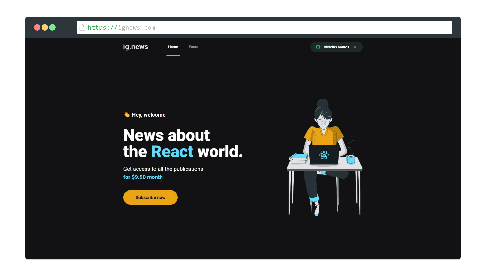
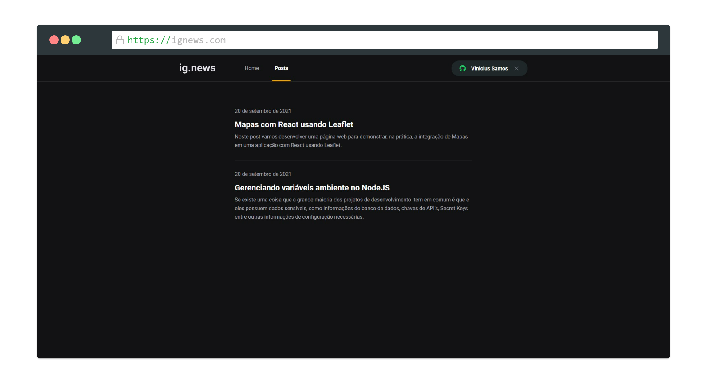

# Ignews

Ignews é um portal de assinatura de notícias do mundo React desenvolvido com Next.js no curso Ignite da Rocketseat.

  

   

  

 

## Tecnologias e Ferramentas

- ReactJS
- Next.js
- Typescript
- Sass
- Banco de dados Faunda DB
- Prismic CMS
- Integração com a api de pagamentos do Stripe

## Principais conceitos aprendidos neste projeto

- Autenticação social utilizando o github.
- Fundamentos do Next como, SSR e SSG.
- Serverless.
- Fluxo de pagamento utilizando o Stripe.
- Utilização do banco de dados FaunaDB.
- Implementação, e utilização do CMS Prismic para publicação dos posts.

 

## Licença

 

Esse projeto está sob a licença MIT. Veja o arquivo [LICENSE](/LICENSE) para mais detalhes.
